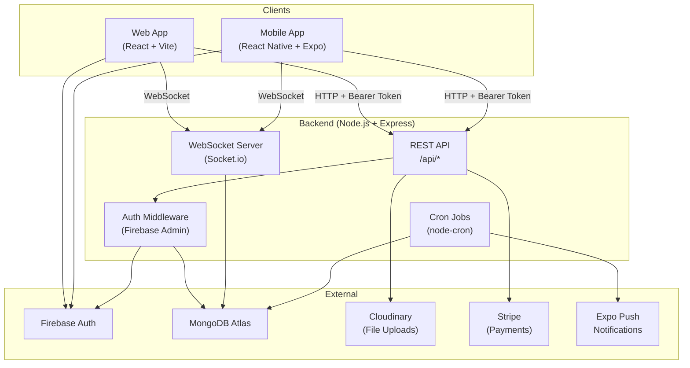
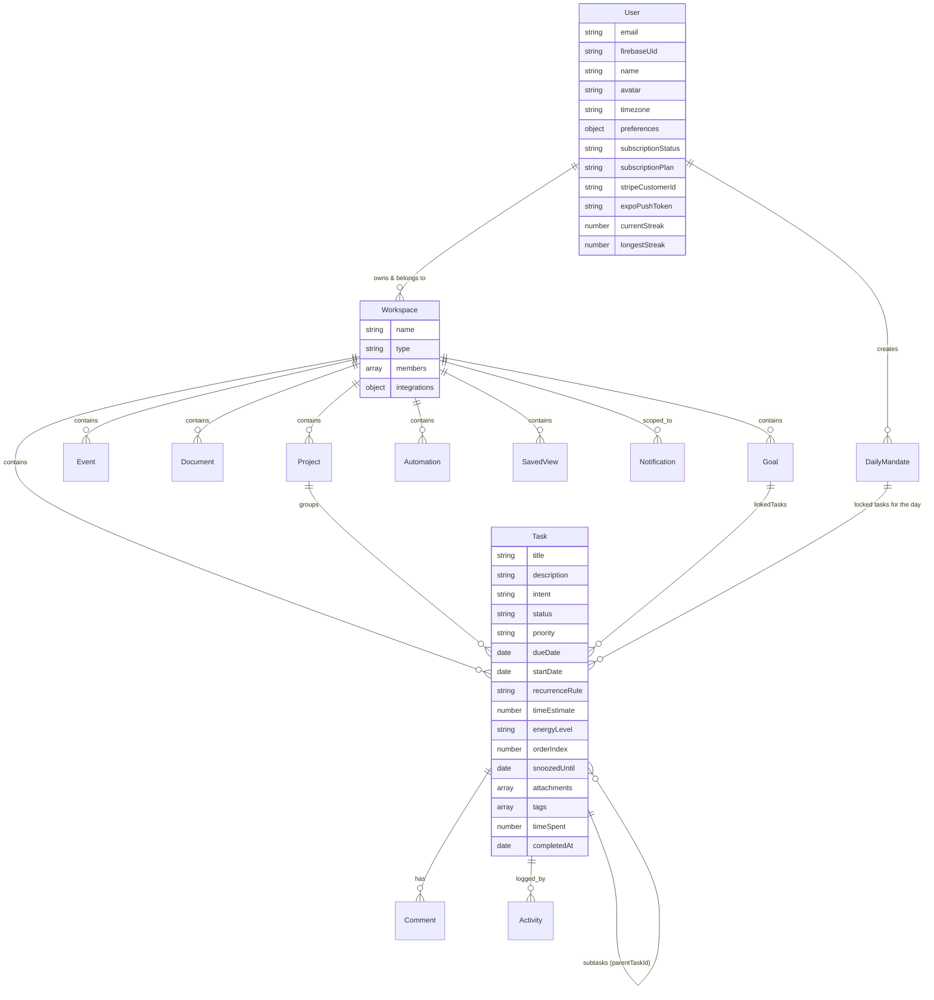
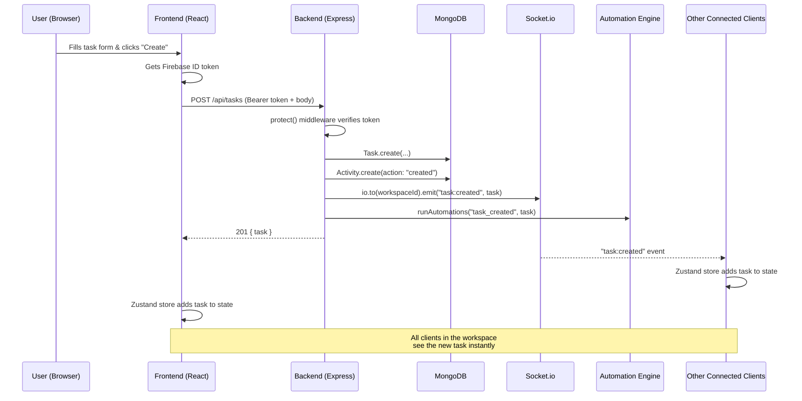

# 🏢 Mandate — Complete Project Deep Dive

Mandate is a **full-stack, real-time task management and collaboration platform** with three deployment targets: a React **web app**, a React Native / Expo **mobile app**, and a Node.js/Express **backend API**.  The live web app is at [mandateapp.netlify.app](https://mandateapp.netlify.app).

---

## 1. High-Level Architecture



> **Note:** The project is a **monorepo** with three independent npm packages at: [`backend/`](./backend), [`frontend/`](./frontend), [`mobile/`](./mobile). The root [`package.json`](./package.json) provides convenience scripts that chain into the sub-packages.

---

## 2. Tech Stack Breakdown

### 2.1 Backend (`backend/`)

| Technology | Purpose |
|---|---|
| **Node.js** | Runtime (v18+) |
| **Express** | HTTP framework, REST API |
| **Mongoose / MongoDB** | ODM + MongoDB Atlas database |
| **Socket.io** | Real-time WebSocket events (task:created, task:updated, task:deleted) |
| **Firebase Admin SDK** | Server-side JWT token verification for authentication |
| **Cloudinary + Multer** | Image/file upload & cloud storage |
| **Stripe** | Subscription payments & webhooks |
| **Expo Server SDK** | Push notifications to the mobile app |
| **node-cron** | Scheduled jobs (recurring tasks, deadline reminders) |
| **express-rate-limit** | API rate limiting |
| **Jest + Supertest** | Backend API testing |
| **mongodb-memory-server** | In-memory MongoDB for tests |

### 2.2 Frontend (`frontend/`)

| Technology | Purpose |
|---|---|
| **React 19** | UI library |
| **Vite** | Dev server & build tool |
| **React Router v7** | Client-side routing |
| **Zustand** | Lightweight global state management |
| **Tailwind CSS** | Utility-first CSS styling |
| **Framer Motion** | Animations & transitions |
| **Lucide React** | Icon library |
| **Axios** | HTTP client (with interceptors for auth) |
| **Socket.io Client** | Real-time event listener |
| **Firebase Client SDK** | Auth flows (sign-in, register, email verification) |
| **@hello-pangea/dnd** | Drag-and-drop (Kanban board) |
| **date-fns** | Date formatting & manipulation |
| **react-hot-toast** | Toast notifications |
| **Playwright** | End-to-end testing |

### 2.3 Mobile (`mobile/`)

| Technology | Purpose |
|---|---|
| **React Native 0.81** | Cross-platform native UI |
| **Expo SDK 54** | Managed workflow, build tooling |
| **React Navigation** | Native stack + bottom tab navigation |
| **Zustand** | Global state (same pattern as web) |
| **@tanstack/react-query** | Server-state caching & data fetching |
| **Axios** | HTTP client |
| **Socket.io Client** | Real-time sync |
| **Firebase Client SDK** | Auth flows |
| **expo-notifications** | Push notification handling |
| **Lucide React Native** | Icons |
| **Google Fonts** | Hanken Grotesk + JetBrains Mono |

---

## 3. File Structure — Annotated

### 3.1 Backend ([`backend/src/`](./backend/src))

```
backend/src/
├── server.js              ← Express app + Socket.io setup, route mounting, DB connect
├── config/
│   ├── db.js              ← MongoDB connection via Mongoose
│   └── firebase.js        ← Firebase Admin SDK initialization
├── middleware/
│   ├── authMiddleware.js   ← protect() and verifyTokenOnly() — Firebase token verification
│   └── rateLimiter.js      ← express-rate-limit configuration
├── models/                 ← 13 Mongoose schemas (see §4 below)
│   ├── Activity.js         ← Audit log entries
│   ├── Automation.js       ← Trigger/action workflow rules
│   ├── Comment.js          ← Task comments
│   ├── DailyMandate.js     ← "Daily plan" — list of tasks locked for the day
│   ├── Document.js         ← Nested wiki-style documents
│   ├── Event.js            ← Calendar events with attendees
│   ├── Goal.js             ← High-level goals linked to tasks
│   ├── Notification.js     ← In-app notifications
│   ├── Project.js          ← Project groupings within a workspace
│   ├── SavedView.js        ← Saved filter/sort/view-type presets
│   ├── Task.js             ← Core task entity (the heart of the app)
│   ├── User.js             ← User profile + preferences + subscription info
│   └── Workspace.js        ← Workspace with members & roles
├── controllers/            ← 16 controller files (business logic)
│   ├── taskController.js   ← CRUD + duplicate + bulk + reorder + analytics
│   ├── authController.js   ← /auth/sync, /auth/me
│   ├── workspaceController.js ← Workspace CRUD, members, invites
│   ├── stripeController.js ← Checkout session + webhook
│   ├── aiController.js     ← AI-powered features
│   ├── searchController.js ← Global cross-entity search
│   └── ... (12 more)
├── routes/                 ← 17 Express route files mapping URLs → controllers
├── services/
│   └── reminderService.js  ← Cron-based 15-min deadline reminders via Socket.io
└── scripts/
    └── cronJobs.js         ← Midnight cron: recurring task duplication + deadline warnings + push notifications
```

### 3.2 Frontend ([`frontend/src/`](./frontend/src))

```
frontend/src/
├── main.jsx               ← React entry, context providers wrapping the app
├── App.jsx                ← 100+ routes (public + protected via ProtectedRoute)
├── index.css              ← Tailwind directives + custom CSS
├── config/
│   └── firebase.js        ← Firebase client initialization
├── context/               ← 3 React contexts
│   ├── AuthContext.jsx     ← Firebase auth + backend user sync
│   ├── WorkspaceContext.jsx← Active workspace management
│   └── SocketContext.jsx   ← Socket.io connection lifecycle
├── store/
│   └── useDataStore.js    ← Zustand store — tasks, socket subscriptions, optimistic updates
├── lib/
│   ├── axios.js           ← Axios instance with Firebase token interceptor
│   └── utils.js           ← Shared utility functions
├── services/              ← API abstraction layer
│   ├── taskService.js     ← Task CRUD API calls
│   ├── projectService.js  ← Project API calls
│   ├── goalService.js     ← Goal API calls
│   └── workspaceService.js← Workspace API calls
├── components/
│   ├── common/            ← ErrorBoundary, GlobalSearchBar, NotificationBell, ProtectedRoute
│   ├── core/              ← CalendarView, KanbanBoard, TaskComposer
│   ├── layout/            ← AppLayout, Sidebar, Navbar, BottomNav, Footer
│   └── ui/                ← Button, Input, TodoCard, TodoModal, EventModal, WorkspaceSwitcher
└── pages/                 ← ~100 page components organized by feature domain
    ├── auth/              ← Login, Register, ForgotPassword, Welcome, Splash, LockIn
    ├── tasks/             ← Today, Backlog, Kanban, Inbox, TaskDetail, BoardView, SprintBoard
    ├── projects/          ← Projects, ProjectDetail, Roadmap, Workstreams, CapacityPlanning
    ├── planning/          ← Calendar, DailyPlanning, EndOfDayReview, MonthlyReview, GoalTimeline
    ├── analytics/         ← Analytics, CustomReports, RetentionInsights, ImpactReport
    ├── automation/        ← Automations, AutomationRules, AutomationLogs, SmartRescheduling
    ├── settings/          ← Settings, Team, Profile, Security, Notifications, Billing, Theme
    ├── dashboard/         ← Home, Admin, TeamWorkspace, TeamHealth, ExecutiveSummary
    └── core/              ← Focus, Review, Docs, Goals, Integrations, GlobalSearch, + many more
```

### 3.3 Mobile ([`mobile/src/`](./mobile/src))

```
mobile/src/
├── config.js              ← API_URL + SOCKET_URL + app settings
├── theme.js               ← Dark/light color tokens, spacing, typography
├── context/               ← 4 React contexts
│   ├── AuthContext.js      ← Firebase auth for mobile
│   ├── WorkspaceContext.js ← Active workspace
│   ├── SocketContext.js    ← Socket.io for React Native
│   └── ThemeContext.js     ← Dark mode toggle
├── store/
│   └── useDataStore.js    ← Zustand store (mirrors frontend pattern)
├── services/              ← API layer (same shape as frontend)
│   ├── api.js             ← Axios instance with token interceptor
│   ├── taskService.js
│   ├── projectService.js
│   ├── goalService.js
│   └── workspaceService.js
└── screens/               ← 80+ screens (same feature domains as frontend pages)
    ├── auth/
    ├── tasks/
    ├── projects/
    ├── planning/
    ├── analytics/
    ├── automation/
    ├── settings/
    ├── dashboard/
    └── core/
```

---

## 4. Data Model (Entity Relationship)



---

## 5. Feature Breakdown — How Each Works

### 5.1 🔐 Authentication Flow

1. **Client** (web or mobile) uses **Firebase Client SDK** for email/password sign-up, sign-in, and email verification.
2. On registration, a verification email is sent. The user **cannot log in** until they verify.
3. After verification and login, Firebase issues an **ID Token (JWT)**.
4. The client calls `POST /api/auth/sync` with the token → the [`authController`](./backend/src/controllers/authController.js) finds-or-creates the user in MongoDB and auto-provisions a default **"Personal" workspace**.
5. All subsequent API calls include `Authorization: Bearer <token>`. The [`protect` middleware](./backend/src/middleware/authMiddleware.js) verifies the token server-side using **Firebase Admin SDK** and attaches `req.user`.

### 5.2 📂 Workspaces & Projects

- **Workspaces** are the top-level organizational unit. Each user starts with a "Personal" workspace. Team workspaces can be created with member roles (`Admin`, `Editor`, `Viewer`).
- **Projects** live inside workspaces (e.g., "Work", "Personal") and group related tasks.
- The [`WorkspaceContext`](./frontend/src/context/WorkspaceContext.jsx) on the frontend manages the active workspace. Switching workspaces calls `PUT /api/workspaces/switch/:id` and reloads data.
- The [`WorkspaceSwitcher`](./frontend/src/components/ui/WorkspaceSwitcher.jsx) component lets users switch between workspaces from the sidebar/navbar.

### 5.3 ✅ Task Management (Core Feature)

**Schema**: [`Task.js`](./backend/src/models/Task.js) — Rich model with status, priority, due dates, recurrence, energy level, time estimates, subtasks, tags, attachments, and time tracking.

**API endpoints** (`/api/tasks`):
- `GET /` — Paginated list with filters (status, priority, project, parentTaskId)
- `GET /:id` — Single task detail
- `POST /` — Create (also logs Activity + emits Socket event + triggers Automations)
- `PUT /:id` — Update (tracks completion, updates streaks, triggers automations on status/priority change)
- `DELETE /:id` — Delete (also logs Activity + emits Socket event)
- `POST /:id/duplicate` — Clone a task
- `POST /bulk` — Bulk delete or update
- `PUT /reorder` — Reorder tasks by `orderIndex`
- `GET /analytics` — Aggregated stats (total, completed, active, deep work ratio, avg resolution time)

**Views on Frontend**:
- [**Today**](./frontend/src/pages/tasks/TodayPage.jsx) — Tasks due today
- [**Backlog**](./frontend/src/pages/tasks/BacklogPage.jsx) — All pending tasks
- [**Kanban**](./frontend/src/pages/tasks/KanbanPage.jsx) — Drag-and-drop board (pending → in-progress → completed → archived), powered by [`@hello-pangea/dnd`](./frontend/src/components/core/KanbanBoard.jsx)
- [**Inbox**](./frontend/src/pages/tasks/InboxPage.jsx) — Notification-triggered task inbox
- [**Task Detail**](./frontend/src/pages/tasks/TaskDetailPage.jsx) — Full task view with subtasks, comments, activity log, attachments

### 5.4 ⚡ Real-Time Sync (WebSockets)

- [`server.js`](./backend/src/server.js) creates a **Socket.io** server and attaches `io` to every request via `req.io`.
- Clients emit `joinWorkspace(workspaceId)` when switching workspaces → server joins them to a Socket.io room.
- When tasks are created/updated/deleted, controllers emit events like `task:created`, `task:updated`, `task:deleted` to the workspace room.
- The [`useDataStore`](./frontend/src/store/useDataStore.js) Zustand store subscribes to these events and **reactively updates the UI** without page refresh.
- The [`SocketContext`](./frontend/src/context/SocketContext.jsx) manages the socket lifecycle.

### 5.5 📅 Calendar & Events

- [`Event.js`](./backend/src/models/Event.js) — Events with title, start/end time, attendees, meeting link, workspace scoping.
- The [`CalendarView`](./frontend/src/components/core/CalendarView.jsx) component renders a monthly calendar grid.
- [`EventModal`](./frontend/src/components/ui/EventModal.jsx) handles create/edit of events.

### 5.6 🎯 Goals

- [`Goal.js`](./backend/src/models/Goal.js) — Goals with progress tracking (0-100%), status (active/achieved/abandoned), target date, and **linked tasks**.
- Progress can be computed from linked task completion.

### 5.7 🤖 Automations

- [`Automation.js`](./backend/src/models/Automation.js) — Rule-based workflow automation with:
  - **Triggers**: `task_created`, `status_changed`, `priority_changed`
  - **Conditions**: field/operator/value matching
  - **Actions**: `change_status`, `change_priority`, `add_tag`, `assign_user`
- [`automationsController.js`](./backend/src/controllers/automationsController.js) has a `runAutomations()` function called from the task controller whenever tasks are created or updated.

### 5.8 📝 Documents (Wiki)

- [`Document.js`](./backend/src/models/Document.js) — Nested page system (like Notion). Documents have a `parentDocId` for hierarchical structure. Content is stored as Markdown or rich HTML.

### 5.9 🔔 Notifications & Reminders

- [`Notification.js`](./backend/src/models/Notification.js) — Types: `reminder`, `assignment`, `comment`, `system`.
- [`reminderService.js`](./backend/src/services/reminderService.js) — Cron job (every minute) checks for tasks due in 15 minutes → creates notifications → broadcasts via Socket.io.
- [`cronJobs.js`](./backend/src/scripts/cronJobs.js) — Midnight job creates deadline warnings + sends **Expo push notifications** to mobile users.
- [`NotificationBell`](./frontend/src/components/common/NotificationBell.jsx) on the frontend shows unread count.

### 5.10 💳 Stripe Payments

- [`stripeController.js`](./backend/src/controllers/stripeController.js) — Creates Stripe checkout sessions and handles webhooks for subscription lifecycle events.
- User model tracks `stripeCustomerId`, `subscriptionStatus`, and `subscriptionPlan`.
- The Stripe webhook route is mounted **before** `express.json()` middleware because it needs the raw request body.

### 5.11 📤 File Uploads

- Uses **Multer** + **Cloudinary** for file uploads. The [`uploadController`](./backend/src/controllers/uploadController.js) handles the multipart upload → Cloudinary pipeline.
- Tasks have an `attachments` array with name, URL, type, and size.

### 5.12 🔍 Global Search

- [`searchController.js`](./backend/src/controllers/searchController.js) — Searches across tasks, projects, goals, and documents using MongoDB text queries.
- [`GlobalSearchBar`](./frontend/src/components/common/GlobalSearchBar.jsx) provides a command-palette-style search interface.

### 5.13 📊 Analytics & Streaks

- The [`getAnalytics`](./backend/src/controllers/taskController.js) endpoint computes: total tasks, completed tasks, active tasks, deep work ratio, and average resolution latency.
- **Streaks**: When a task is completed, the task controller checks if the user was active yesterday → increments `currentStreak` or resets to 1. Longest streak is tracked.
- [`Activity.js`](./backend/src/models/Activity.js) model logs all actions (created, completed, deleted) for audit trails.

### 5.14 📋 Daily Mandate (Daily Planning)

- [`DailyMandate.js`](./backend/src/models/DailyMandate.js) — Each user "locks in" a set of tasks for a specific day. Unique per user per day.
- [`planningController.js`](./backend/src/controllers/planningController.js) manages the daily planning flow.
- This powers the "Lock In" and "Daily Planning" pages.

### 5.15 🔄 Recurring Tasks

- Tasks can have a `recurrenceRule` field: `"daily"`, `"weekly"`, or `"monthly"`.
- The midnight cron job in [`cronJobs.js`](./backend/src/scripts/cronJobs.js) finds completed recurring tasks and automatically creates the next occurrence with the appropriate due date.

### 5.16 🏷️ Saved Views

- [`SavedView.js`](./backend/src/models/SavedView.js) — Users can save filter/sort/view-type combinations (list, kanban, calendar, timeline, table) and reload them later.

### 5.17 💬 Comments

- [`Comment.js`](./backend/src/models/Comment.js) — Users can comment on tasks. Comments are timestamped and author-tracked.

### 5.18 🧠 AI Features

- [`aiController.js`](./backend/src/controllers/aiController.js) — AI-powered endpoints for smart features like task breakdown, priority recommendations, and rescheduling suggestions.

---

## 6. Data Flow — Creating a Task (End-to-End)



---

## 7. Deployment Architecture

| Layer | Service | Details |
|---|---|---|
| **Frontend** | Netlify | Vite build → static SPA, CDN-distributed. [`netlify.toml`](./frontend/netlify.toml) handles SPA redirects. |
| **Backend** | Render | Node.js web service, supports WebSockets. Start command: `node src/server.js` |
| **Database** | MongoDB Atlas | Cloud-hosted MongoDB cluster |
| **Auth** | Firebase | Google's managed auth service |
| **Storage** | Cloudinary | Image/file CDN |
| **Payments** | Stripe | Subscription billing |
| **Push Notifications** | Expo Push | Native push for iOS/Android |

---

## 8. Context Provider Hierarchy

### Frontend
```
<BrowserRouter>
  <AuthProvider>          ← Firebase auth state + backend user sync
    <WorkspaceProvider>   ← Active workspace + workspace list
      <SocketProvider>    ← Socket.io connection lifecycle
        <App />           ← Routes + pages
        <Toaster />       ← Toast notifications
      </SocketProvider>
    </WorkspaceProvider>
  </AuthProvider>
</BrowserRouter>
```

### Mobile
```
<SafeAreaProvider>
  <ThemeProvider>            ← Dark/light mode
    <AuthProvider>           ← Firebase auth
      <WorkspaceProvider>    ← Active workspace
        <SocketProvider>     ← Socket.io connection
          <NavigationContainer>
            <Stack.Navigator> / <Tab.Navigator>
          </NavigationContainer>
        </SocketProvider>
      </WorkspaceProvider>
    </AuthProvider>
  </ThemeProvider>
</SafeAreaProvider>
```

---

## 9. Key Design Patterns

| Pattern | Where Used |
|---|---|
| **Context + Zustand hybrid** | Auth/Workspace/Socket in Context; task data in Zustand for performance |
| **Optimistic UI updates** | `useDataStore.moveTask()` updates state immediately, syncs to backend in background |
| **Socket.io rooms** | Workspace-scoped real-time events (clients join/leave workspace rooms) |
| **req.io pattern** | Socket.io instance attached to Express requests via middleware for controller access |
| **Interceptor-based auth** | Axios interceptor auto-attaches Firebase token to every request |
| **Activity logging** | Every task CRUD logs to the Activity collection for audit/analytics |
| **Trigger-condition-action automation** | Automations run asynchronously after task mutations |
| **Cron-based background jobs** | Recurring task creation, deadline warnings, push notifications |

---

## 10. API Route Map (17 Route Files)

| Route Prefix | File | Key Operations |
|---|---|---|
| `/api/auth` | [`authRoutes.js`](./backend/src/routes/authRoutes.js) | sync, me |
| `/api/tasks` | [`taskRoutes.js`](./backend/src/routes/taskRoutes.js) | CRUD, duplicate, bulk, reorder, analytics |
| `/api/workspaces` | [`workspaceRoutes.js`](./backend/src/routes/workspaceRoutes.js) | CRUD, members, switch |
| `/api/projects` | [`projectRoutes.js`](./backend/src/routes/projectRoutes.js) | CRUD |
| `/api/events` | [`eventRoutes.js`](./backend/src/routes/eventRoutes.js) | Calendar event CRUD |
| `/api/comments` | [`commentRoutes.js`](./backend/src/routes/commentRoutes.js) | Task comment CRUD |
| `/api/goals` | [`goalRoutes.js`](./backend/src/routes/goalRoutes.js) | Goal CRUD |
| `/api/documents` | [`documentRoutes.js`](./backend/src/routes/documentRoutes.js) | Document/wiki CRUD |
| `/api/notifications` | [`notificationRoutes.js`](./backend/src/routes/notificationRoutes.js) | List, mark read |
| `/api/automations` | [`automationRoutes.js`](./backend/src/routes/automationRoutes.js) | Automation rule CRUD |
| `/api/ai` | [`aiRoutes.js`](./backend/src/routes/aiRoutes.js) | AI features |
| `/api/planning` | [`planningRoutes.js`](./backend/src/routes/planningRoutes.js) | Daily mandate |
| `/api/search` | [`searchRoutes.js`](./backend/src/routes/searchRoutes.js) | Global search |
| `/api/upload` | [`uploadRoutes.js`](./backend/src/routes/uploadRoutes.js) | File upload |
| `/api/stripe` | [`stripeRoutes.js`](./backend/src/routes/stripeRoutes.js) | Checkout + webhooks |
| `/api/users` | [`userRoutes.js`](./backend/src/routes/userRoutes.js) | Profile update |
| `/api/activities` | [`activityRoutes.js`](./backend/src/routes/activityRoutes.js) | Activity feed |

---

## 11. Running the Project Locally

### Prerequisites
- Node.js (v18+)
- MongoDB Atlas

### 1. Backend Setup
```bash
cd backend
npm install

# Create a .env file with:
# PORT=5001
# MONGO_URI=your_mongo_connection_string
# FIREBASE_* keys

npm run dev    # nodemon — auto-restarts on changes
```

### 2. Frontend Setup
```bash
cd frontend
npm install

# Create a .env file with:
# VITE_API_URL=http://localhost:5001

npm run dev    # Vite dev server at localhost:5173
```

### 3. Mobile Setup
```bash
cd mobile
npm install

# Create a .env file with:
# API_URL=http://<your-ip>:5001

npx expo start  # Opens Expo dev tools
```

Visit `http://localhost:5173` to explore your workspace!
