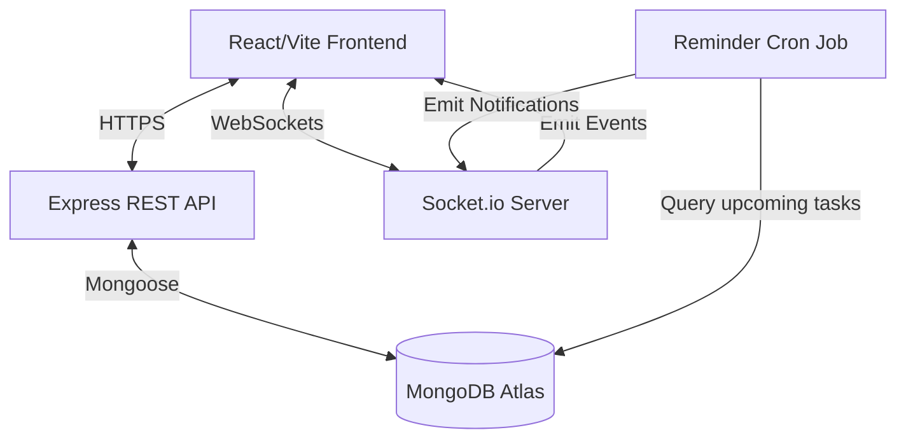

# 🏛️ Mandate Architecture

Mandate is built on a modern MERN stack optimized for real-time collaboration, strict tenant isolation (workspaces), and high performance through caching.

## High-Level System Design

## Core Patterns

### 1. Multi-Tenant Workspaces
The data model revolves around the `Workspace`. Every user has a default personal workspace created upon registration. 
- **Isolation:** Every entity (`Todo`, `Event`, `Comment`, `Notification`) has a required `workspaceId`.
- **API Flow:** All backend controllers extract the `workspaceId` from the authenticated request context (via the `protect` middleware parsing `req.user.activeWorkspace`) to isolate data.

### 2. Real-Time Reactivity
We use **Socket.io** to provide immediate UI updates across team members.
- The React client connects to the socket server upon authentication.
- The client joins a Socket Room named after the `workspaceId`.
- When a client creates a Todo (via REST API), the backend saves it to MongoDB, then broadcasts `todo_created` to the `workspaceId` room.
- Other active clients receive the payload and optimistically update their local state without needing to refresh.

### 3. Automated Reminder Engine
A lightweight scheduled job runs on the Node server.
- The `reminderService.js` script runs every 60 seconds.
- It queries MongoDB for `Todo`s with deadlines approaching in the next 15 minutes.
- It creates a `Notification` document and broadcasts a `notification_created` socket event to the active Workspace members.
